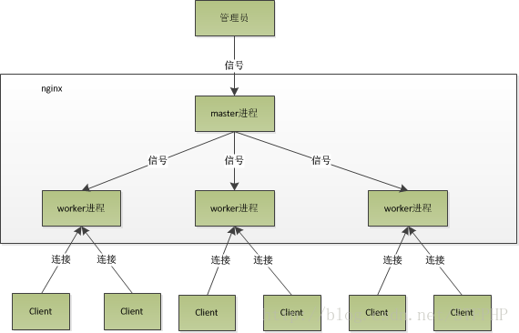

## 4.nginx 的架构

### 4.1 轻量

* 源代码只包含核心模块
* 其他非核心功能都是通过模块实现，可以自由选择

### 4.2 架构

* Nginx 采用的是多进程（单线程）和多路 IO 复用模型

### 4.2.1 工作流程

1.Nginx 在启动后，会有一个`master` 进程和多个相互独立的`worker`进程。

2.接收来自外界的信号，向各`worker`进程发送信号，每个进程都有可能来处理这个连接。

3.master 进程能监控 worker 进程的运行状态，当 worker 进程退出后（异常情况下），会自动启动新的 worker 进程。

* worker 进程数，一般会设置成机器 cpu 核数。因为更多的 worker 数，只会导致进程相互竞争 cpu，从而带来不必要的上下文切换。
* 使用多进程模式，不仅能提高并发率，而且进程之间相互独立，一个 worker 进程挂了不会影响到其他 worker 进程。
